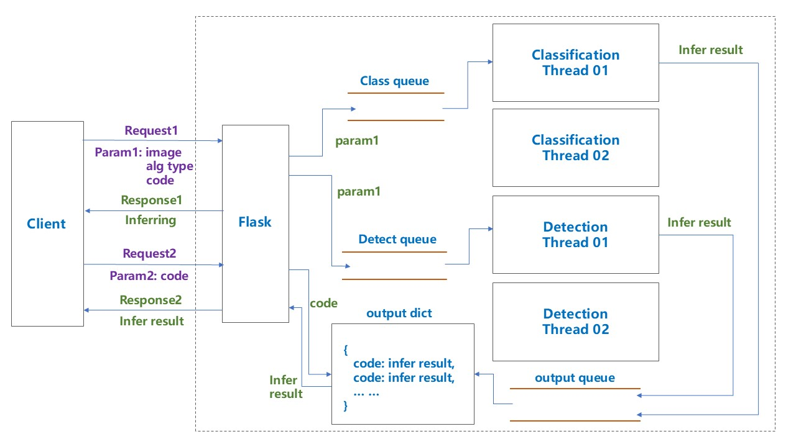

# 图像算法推理服务

## 简介

- 仿照 nVidia tritonserver 写的简易的算法服务框架



## 运行

### 启动服务端

- 运行：

```bash
cd server
python serve.py
```

- 看到如下日志：

```bash
root@f4da28e277f2:/workspace/server# python serve.py
 * Serving Flask app 'serve'
 * Debug mode: off
WARNING: This is a development server. Do not use it in a production deployment. Use a production WSGI server instead.
 * Running on all addresses (0.0.0.0)
 * Running on http://127.0.0.1:32802
 * Running on http://172.17.0.2:32802
Press CTRL+C to quit
2024-10-11 11:10:56,453 - alg_process.py - INFO - Detection model load successfully.
2024-10-11 11:10:56,462 - alg_process.py - INFO - Detection model load successfully.
2024-10-11 11:10:59,599 - alg_process.py - INFO - Classification model load successfully.
2024-10-11 11:10:59,658 - alg_process.py - INFO - Classification model load successfully.
```

### 启动客户端

- 运行：

```bash
cd client
python cli.py
```

- 看到如下日志：

```bash
       detection  0.10s                 ./test_images/dog.jpg  {'bboxes': [[131, 222, 309, 540], [125, 122, 566, 420], [467, 73, 693, 170]], 'classes': ['dog', 'bicycle', 'truck'], 'scores': [0.93, 0.88, 0.78]}
  classification  0.08s      ./test_images/sunflowers_04.jpeg  {'class': 'sunflowers', 'score': 1.0}
       detection  0.10s                 ./test_images/dog.jpg  {'bboxes': [[131, 222, 309, 540], [125, 122, 566, 420], [467, 73, 693, 170]], 'classes': ['dog', 'bicycle', 'truck'], 'scores': [0.93, 0.88, 0.78]}
  classification  0.13s            ./test_images/roses_03.jpg  {'class': 'roses', 'score': 1.0}
  classification  0.07s      ./test_images/sunflowers_04.jpeg  {'class': 'sunflowers', 'score': 1.0}
       detection  0.07s             ./test_images/single.jpeg  {'bboxes': [[179, 72, 479, 416]], 'classes': ['person'], 'scores': [0.97]}
  classification  0.11s            ./test_images/roses_03.jpg  {'class': 'roses', 'score': 1.0}
  classification  0.08s      ./test_images/sunflowers_04.jpeg  {'class': 'sunflowers', 'score': 1.0}
  classification  0.08s      ./test_images/sunflowers_04.jpeg  {'class': 'sunflowers', 'score': 1.0}
  classification  0.14s            ./test_images/roses_03.jpg  {'class': 'roses', 'score': 1.0}
       detection  0.07s             ./test_images/single.jpeg  {'bboxes': [[179, 72, 479, 416]], 'classes': ['person'], 'scores': [0.97]}
  classification  0.12s            ./test_images/roses_03.jpg  {'class': 'roses', 'score': 1.0}
  classification  0.08s      ./test_images/sunflowers_04.jpeg  {'class': 'sunflowers', 'score': 1.0}
       detection  0.08s             ./test_images/single.jpeg  {'bboxes': [[179, 72, 479, 416]], 'classes': ['person'], 'scores': [0.97]}
  classification  0.15s            ./test_images/roses_03.jpg  {'class': 'roses', 'score': 1.0}
  classification  0.08s      ./test_images/sunflowers_04.jpeg  {'class': 'sunflowers', 'score': 1.0}
       detection  0.09s                 ./test_images/dog.jpg  {'bboxes': [[131, 222, 309, 540], [125, 122, 566, 420], [467, 73, 693, 170]], 'classes': ['dog', 'bicycle', 'truck'], 'scores': [0.93, 0.88, 0.78]}
  classification  0.07s      ./test_images/sunflowers_04.jpeg  {'class': 'sunflowers', 'score': 1.0}
       detection  0.13s                 ./test_images/dog.jpg  {'bboxes': [[131, 222, 309, 540], [125, 122, 566, 420], [467, 73, 693, 170]], 'classes': ['dog', 'bicycle', 'truck'], 'scores': [0.93, 0.88, 0.78]}  classification  0.07s      ./test_images/sunflowers_04.jpeg  {'class': 'sunflowers', 'score': 1.0}
```